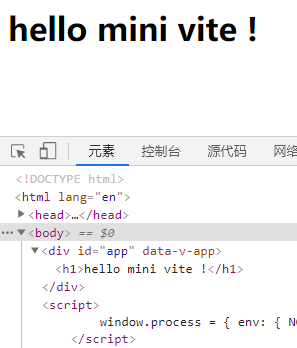

# mini-vite

初始化一个新项目

```
npm init -y
```

安装Koa

```
yarn add koa
```

在根目录建一个mini-vite.js文件构建一个koa服务器

```javascript
const Koa = require('koa')
const app = new Koa()
const fs = require('fs')

// 返回用户首页
app.use(async ctx => {
    ctx.body = 'mini vite ~'
})

app.listen(9527, () => {
    console.log("mini vite start ~")
})
```

我们要读取index.html文件返回给用户首页需要用到fs模块

```javascript
const fs = require('fs')
```

拿到用户当前请求的URL，判断如果是首页就读取index.html内容返回给前端

```javascript
const { url } = ctx.request
if(url === '/') {
    ctx.type = "text/html"
    ctx.body = fs.readFileSync('./index.html', 'utf8')
}
```
这个时候我们发现前端向后端发送了一个main.js文件的请求

 

所以后端要响应这个请求

```javascript
if(url === '/') {
    // ...
} else if(url.endsWith('.js')) {
    // 响应JS请求
    const jsPath = path.join(__dirname, url) // 转成绝对地址进行加载
    ctx.type = "text/javascript" // 告诉浏览器这是一个JavaScript文件
    ctx.body = fs.readFileSync(jsPath, 'utf8')
}
```

我们发现前端main.js请求成功了

 

接下来我们安装一下Vue3，在main.js里写vue3应用

```
yarn add vue@next
```

写vue3应用，我们先不写tamplate，因为写tamplate需要编译，我们小步快走，先写个渲染函数。

```javascript
import { createApp, h } from 'vue'
createApp({
    render: () => h("h1", "hello mini vite !")
}).mount("#app")
```

我们这样写了一个Vue3应用了之后发现浏览器报错了

 

这个报错的意思是说加载的模块地址需要是相对地址。

这个时候我们就需要在Vite服务器里对`'vue'`地址进行重写，也就是所谓预编译，不然服务器加载不了。我们需要对这个`'vue'`处理成一个相对地址，比如处理成`'/@modules/vue'`，让浏览器能够进行请求，Vite服务器就可以去`node_modules`模块里进行加载vue文件了。

在Vite服务器里，当遇到JS文件时候，对那些加载不是相对地址模块，处理成一个相对地址。

写一个函数处理模块地址

```javascript
/**
 * 重新导入，变成相对地址
 */
function rewriteImport(content) {
    return content.replace(/ from ['|"](.*)['|"]/g, function(s0, s1) {
        // s0匹配字符串，s1分组内容
        // 看看是不是相对地址
        if(s1.startsWith('.') || s1.startsWith('/') || s1.startsWith('../')) {
            // 原封不动返回
            return s0
        } else {
            return ` from '/@modules/${s1}'`
        }
    })
}
```

我们发现main.js里的vue模块地址已经被处理成`'/@modules/vue'`了。

 

而且也向Vite服务器进行了请求

 

接下来我们需要响应这个请求

首先一个正规的npm包的根目录肯定有一个package.json的文件，这个文件会有一个`module` 的字段记录着这个包的输出文件地址，比如我们要请求的这个vue包，它的根目录的package.json里的module字段信息是这样的：

 

依赖加载代码

```javascript
if(url.startsWith('/@modules/')) {
    // 获取@modules后面的部分，模块名称
    const moduleName = url.replace('/@modules/', '')
    const prefix = path.join(__dirname, './node_modules', moduleName)
    // 要加载文件的地址
    const module = require(prefix + '/package.json').module
    const filePath = path.join(prefix, module)
    const res = fs.readFileSync(filePath, 'utf8')
    ctx.type = "text/javascript" 
    ctx.body = rewriteImport(res) // 在其内部可能还存在import代码，所以也需要重写一下
 }
```

这个时候我们发现除了vue文件，还加载了很多其他的包

 

这个时候需要在index.html里模拟一个node服务器变量

```html
<script>
  window.process = { env: { NODE_ENV: 'dev' } }
</script>
<script type="module" src="./src/main.js"></script>
```

不然会报一个错误

 

模拟完node服务器变量之后，就成功渲染了

 

解析vue文件

新建一个App.vue文件

```javascript
<template>
    <div>
        {{title}}
    </div>
</template>
<script>
import { ref } from 'vue'
export default {
    setup () {
        const title = ref('hello, coboy ~')
        return { title }
    }
}
</script>
```

然后再main.js里引入

```javascript
import App from './App.vue'
```

发现报错了，因为我们还没对vue文件的请求进行处理

 

